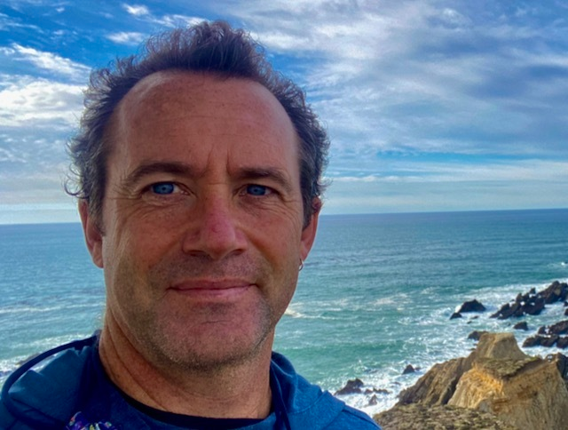
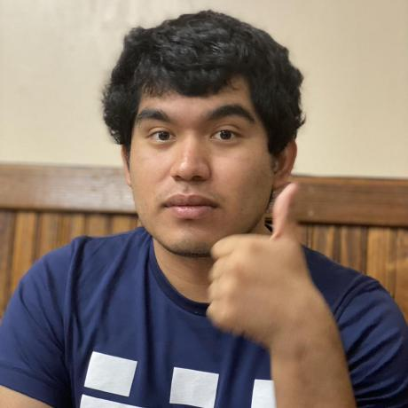
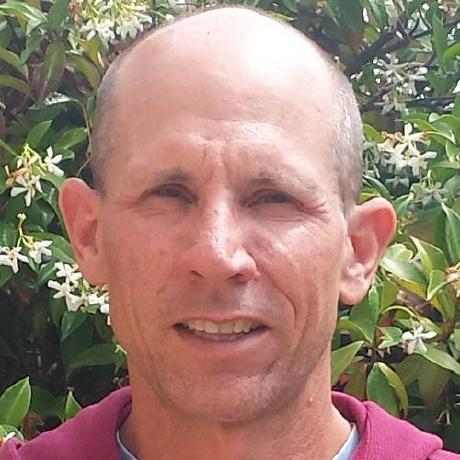

# Contact

Questions about adopting? We're here to help.

Email **[ds-help@berkeley.edu](mailto:ds-help@berkeley.edu)** and we'll point you to the right
person. For common issues, see [Support](how-to-adopt/support.md) and the
[FAQ](resources/faq.md).

## Meet the team

{ .team-avatar }

**Eric Van Dusen**

Program lead, outreach & overall direction
{ .team-role }

[:fontawesome-brands-github:](https://github.com/ericvd-ucb) [:fontawesome-brands-linkedin:](https://www.linkedin.com/in/ericvd/) [:fontawesome-solid-envelope:](mailto:ericvd@berkeley.edu)

{ .team-avatar }

**Kseniya Usovich**

California Data Science outreach & promotion
{ .team-role }

[:fontawesome-brands-github:](https://github.com/kseniyausovich) [:fontawesome-brands-linkedin:](https://www.linkedin.com/in/kseniya-usovich-45419a9b) [:material-web:](https://ca-datascience.github.io/) [:fontawesome-solid-envelope:](mailto:k_usovich@berkeley.edu)

{ .team-avatar }

**Edwin Vargas Navarro**

Adoption materials, tooling & autograder support
{ .team-role }

[:fontawesome-brands-github:](https://github.com/jedwin3210) [:fontawesome-brands-linkedin:](https://www.linkedin.com/in/edwin-vargas-navarro-423014237/) [:fontawesome-solid-envelope:](mailto:jedwin321@berkeley.edu)

{ .team-avatar }

**Sean Morris**

Adoption materials, hub setup & onboarding
{ .team-role }

[:fontawesome-brands-github:](https://github.com/sean-morris) [:fontawesome-solid-envelope:](mailto:sean.smorris@berkeley.edu)

