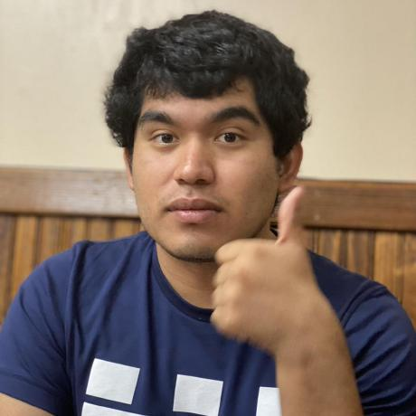

# Contact

Questions about adopting? We're here to help.

Email **[ds-help@berkeley.edu](mailto:ds-help@berkeley.edu)** and we'll point you to the right
person. For common issues, see [Support](how-to-adopt/support.md) and the
[FAQ](resources/faq.md).

## Meet the team

{ .team-avatar }

**Eric Van Dusen**

Program lead, outreach & overall direction
{ .team-role }

[:fontawesome-brands-github: Eric Van Dusen on GitHub](https://github.com/ericvd-ucb){ .team-social }
[:fontawesome-brands-linkedin: Eric Van Dusen on LinkedIn](https://www.linkedin.com/in/ericvd/){ .team-social }
[:fontawesome-solid-envelope: Email Eric Van Dusen](mailto:ericvd@berkeley.edu){ .team-social }

{ .team-avatar }

**Kseniya Usovich**

California Data Science outreach & promotion
{ .team-role }

[:fontawesome-brands-github: Kseniya Usovich on GitHub](https://github.com/kseniyausovich){ .team-social }
[:fontawesome-brands-linkedin: Kseniya Usovich on LinkedIn](https://www.linkedin.com/in/kseniya-usovich-45419a9b){ .team-social }
[:material-web: Kseniya Usovich's website](https://ca-datascience.github.io/){ .team-social }
[:fontawesome-solid-envelope: Email Kseniya Usovich](mailto:k_usovich@berkeley.edu){ .team-social }

{ .team-avatar }

**Edwin Vargas Navarro**

Adoption materials, tooling & autograder support
{ .team-role }

[:fontawesome-brands-github: Edwin Vargas Navarro on GitHub](https://github.com/jedwin3210){ .team-social }
[:fontawesome-brands-linkedin: Edwin Vargas Navarro on LinkedIn](https://www.linkedin.com/in/edwin-vargas-navarro-423014237/){ .team-social }
[:fontawesome-solid-envelope: Email Edwin Vargas Navarro](mailto:jedwin321@berkeley.edu){ .team-social }

{ .team-avatar }

**Sean Morris**

Adoption materials, hub setup & onboarding
{ .team-role }

[:fontawesome-brands-github: Sean Morris on GitHub](https://github.com/sean-morris){ .team-social }
[:fontawesome-solid-envelope: Email Sean Morris](mailto:sean.smorris@berkeley.edu){ .team-social }

