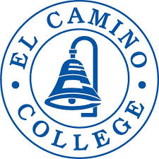



{ .hero-logo }
# El Camino College CSCI 9: Practical Data Science

!!! note "Not a UC Berkeley course"

    This course originates from [El Camino College]({{ c.catalog_url }}), not UC Berkeley.
    It is a collaboration with
    [UC Berkeley Data Science Modules](https://ds-modules.github.io/ecc-textbook/ecc-calenviroscreen/)
    and is included here because it uses the same open-source infrastructure and adoption
    workflow as the Berkeley courses on this site.

!!! info "Adoption materials in progress"

    A full adoption package is actively being developed. Public student materials and
    instructor resources are available now; the standardized
    [adoption workflow](../how-to-adopt/index.md) will apply once the package is complete.

## Materials

- **CSCI 9 Textbook:**
  [ds-modules.github.io/ecc-cs9-textbook](https://ds-modules.github.io/ecc-cs9-textbook/)
- **Data Science Modules:**
  [ds-modules.github.io/ecc-textbook](https://ds-modules.github.io/ecc-textbook/ecc-calenviroscreen/)
- **Browse notebooks in your browser:**
  [{{ c.title }} xeus-lite]({{ c.xeus_lite }})
- **Public student materials:**
  [{{ c.materials_repo_name }}]({{ c.materials_repo }})
- **Private instructor repo** (solutions and course-development materials):
  [{{ c.solutions_repo_name }}]({{ c.solutions_repo }}). To request access, complete the
  [CSCI 9 Instructor Interest Form]({{ c.interest_form }}).

## Explore the materials in your browser



## Get notified

Interested in adopting this course? Complete the
[CSCI 9 Instructor Interest Form]({{ c.interest_form }}) or email
[{{ support_email }}](mailto:{{ support_email }}) and we'll help you get started.
