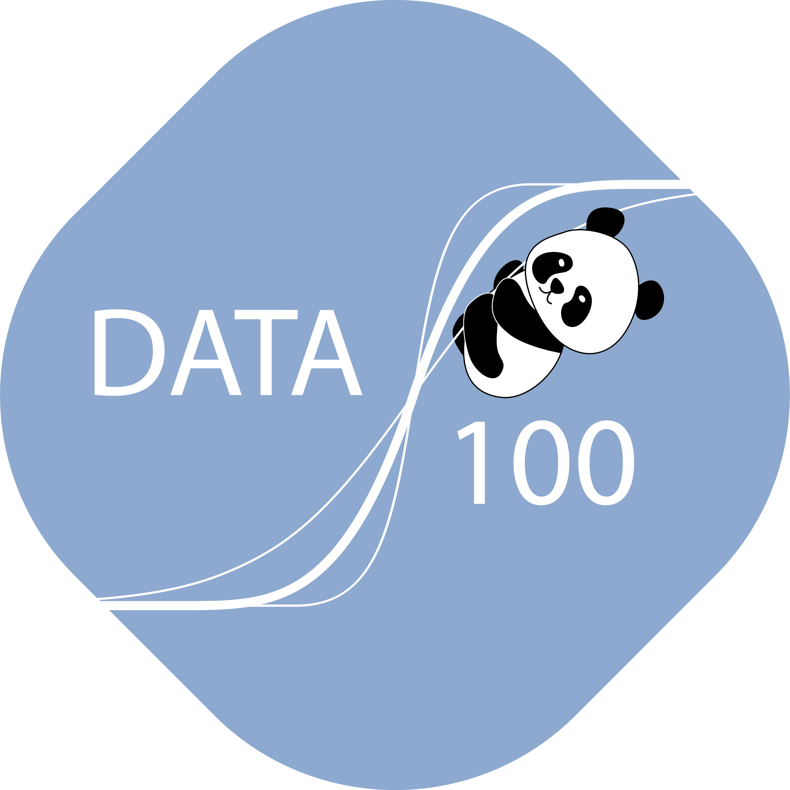



{ .hero-logo }
# Data 100: Principles and Techniques of Data Science

!!! info "Adoption materials in progress"

    A full Data 100 adoption package is actively being developed. Public student materials and
    instructor resources are available now; the standardized
    [adoption workflow](../how-to-adopt/index.md) will apply once the package is complete.

Data 100 is UC Berkeley's upper-division "Principles and Techniques of Data Science"
course, building on Data 8 with deeper coverage of the data science lifecycle, modeling,
and machine learning.

## Materials

- Course site: [ds100.org](https://ds100.org)
- Course notes: [ds100.org/course-notes](https://ds100.org/course-notes/)
- Optional supplementary textbook:
  [Learning Data Science](https://learningds.org/intro.html)
- **Public student materials:**
  [{{ c.materials_repo_name }}]({{ c.materials_repo }})
- **Private instructor repo** (solutions and instructor materials):
  [{{ c.solutions_repo_name }}]({{ c.solutions_repo }}) — complete the
  [Data 100 Instructor Interest Form]({{ c.interest_form }}) for access.

## Get started

Interested in adopting Data 100? Complete the
[Data 100 Instructor Interest Form]({{ c.interest_form }}) or email
[{{ support_email }}](mailto:{{ support_email }}) and we'll help you get started.
