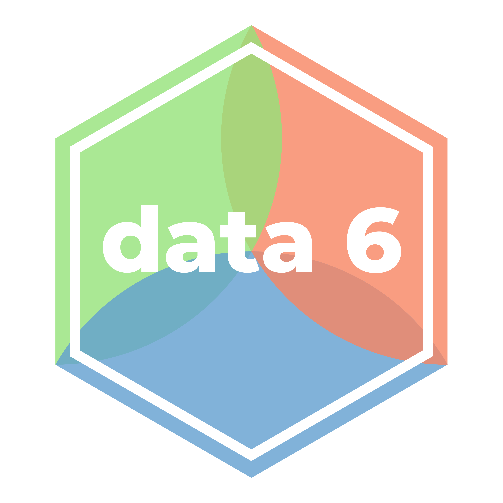



{ .hero-logo }
# Data 6: Computational Thinking with Data Science and Society

Data 6, "Introduction to Computational Thinking with Data Science and Society," is an
introductory, interdisciplinary course taught at UC Berkeley. It combines statistics,
computer science, and social science to give students a practical introduction to
computational thinking and exploratory data analysis. The full set of materials is
available to adopt.

- Course notes: [data6.org/notes](https://data6.org/notes/)
- Zero to Data 6 guide: [data6.org/zero-to-data-6](http://data6.org/zero-to-data-6/) -
  context and resources for running Data 6
- Browse notebooks in your browser: [{{ c.title }} xeus-lite]({{ c.xeus_lite }})
- Public student materials: [{{ c.materials_repo_name }}]({{ c.materials_repo }})

!!! tip "Quick start"

    1. Complete the [Data 6 Instructor Interest Form]({{ c.interest_form }})
    2. Fork the [student materials]({{ c.materials_repo }})
    3. Follow the steps below

## 1. Get access

Create a GitHub account if needed, then complete the
[Instructor Interest Form]({{ c.interest_form }}) (expect a response within ~24 hours).
Fork the student materials at [{{ c.materials_repo_name }}]({{ c.materials_repo }}), and
accept the invitations to the private solutions repository
([{{ c.solutions_repo_name }}]({{ c.solutions_repo }})) and the
[Otter Service Standalone org]({{ otter_org_url }}).

**Screen recording: forking the student materials**



## 2. Set up Canvas

Download the [Data 6 Canvas template](https://drive.google.com/file/d/1ioxchiwz1PPDJk6A5X-HVJeIR0n4rMRl/view?usp=sharing).

### Point assignments at your JupyterHub



### Import into Canvas



!!! tip "Other LMS platforms"

    If you're not using Canvas, the core notebooks are platform-independent and can be
    linked from any LMS.

## 3. Student workflow



## 4. Grade with Otter



### Instructor grading checklist



## Course notes

The [Data 6 course notes](https://data6.org/notes/) serve as lecture notes for the course
(source: [data-6-berkeley/notes](https://github.com/data-6-berkeley/notes)). They complement
each topic but should be supplemented with foundational texts linked within the notes.

## Explore the materials in your browser



## License

The Data 6 course notes are licensed under
[Creative Commons Attribution-NonCommercial-ShareAlike 4.0 International (CC-BY-NC-SA 4.0)](https://creativecommons.org/licenses/by-nc-sa/4.0/).
Under ShareAlike, if you adapt the notes you must release your version under the same
license. See [Understanding Licenses](../how-to-adopt/licenses.md) for how to read these
terms.

## Acknowledgments

This material is based upon work supported by the U.S. National Science Foundation under
award Nos. [2245877](https://www.nsf.gov/awardsearch/showAward?AWD_ID=2245877),
[2245878](https://www.nsf.gov/awardsearch/showAward?AWD_ID=2245878),
[2245879](https://www.nsf.gov/awardsearch/showAward?AWD_ID=2245879), and the California
Learning Lab. Learn more about the DUBOIS project at
[dubois-ctds.github.io](https://dubois-ctds.github.io/).

## Need help?

Email [{{ support_email }}](mailto:{{ support_email }}) or see [Support](../how-to-adopt/support.md).
