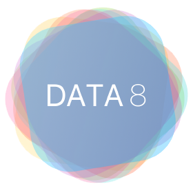
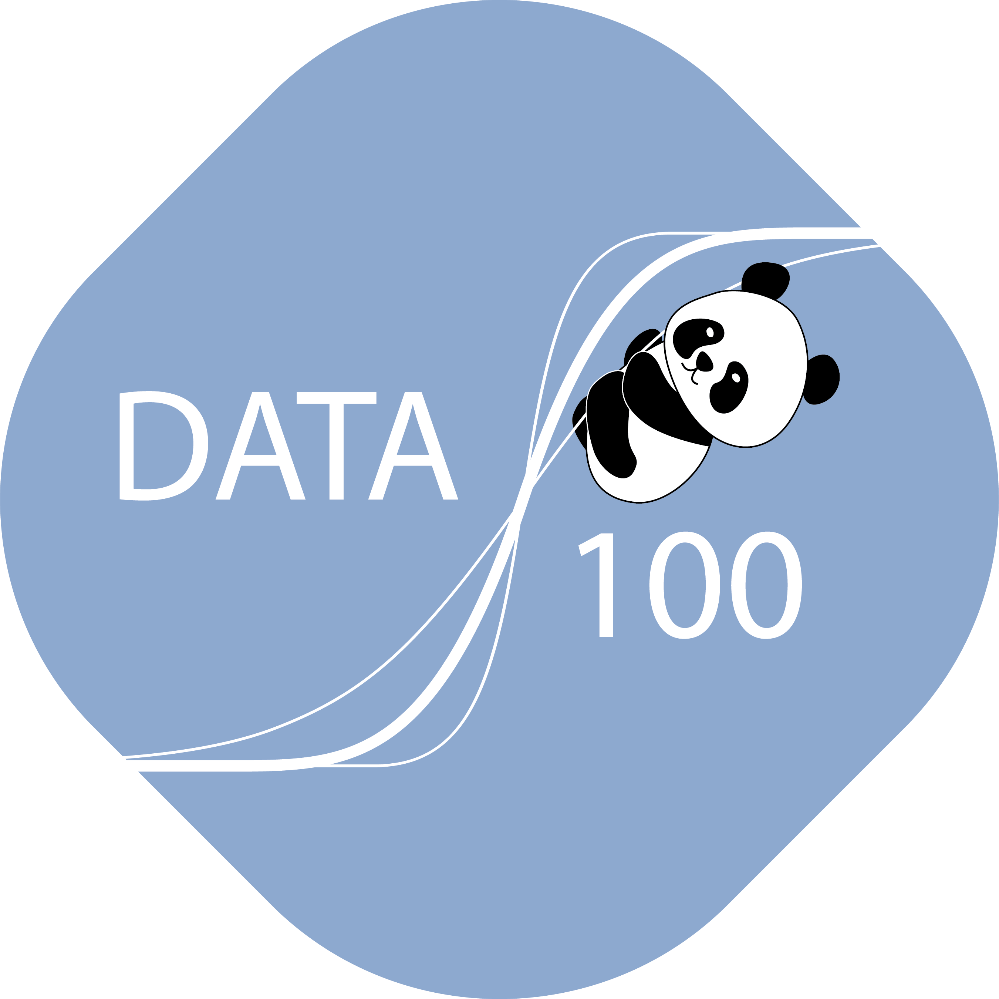

# Courses

Choose a Berkeley data science course and follow its adoption page for repositories, hub, and license details.

Each course below follows the same [adoption workflow](../how-to-adopt/index.md); the
course page fills in the specific repositories, Canvas template, hub, license, and any
course-specific notes.

-   { .card-logo } **[Data 8: Foundations of Data Science](data8.md)**

    ---

    Full adoption package. Inference, computing, and statistics for first-year students.
    Two adoption versions; split textbook / materials licensing.

-   { .card-logo } **[Data 6: Computational Thinking with Data Science and Society](data6.md)**

    ---

    Full adoption package. Interdisciplinary introduction with course notes and grading infrastructure.

-   **[El Camino College CSCI 9: Practical Data Science](data9.md)**

    ---

    *Not a UC Berkeley course.* Adoption materials in progress. Existing resources available now.

-   { .card-logo } **[Data 100: Principles and Techniques of Data Science](data100.md)**

    ---

    Adoption materials in progress. Existing resources available now.

